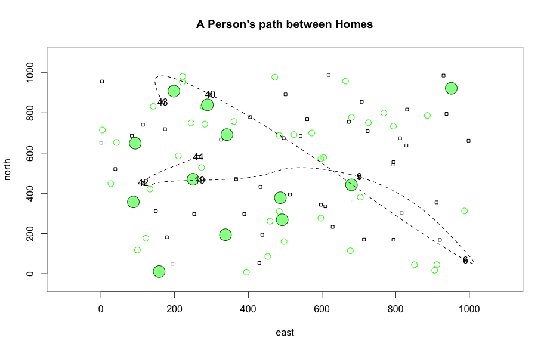

# August 24: Getting Started with R and RStudio

Above is a curved spline of a person's path between homes. Random numbers from 1-1000 as xy coordinates and were generated and plotted 50 times to create houses (squares), and seven were randomly selected to be labeled and connected. Green trees and larger green trees are also generated.
