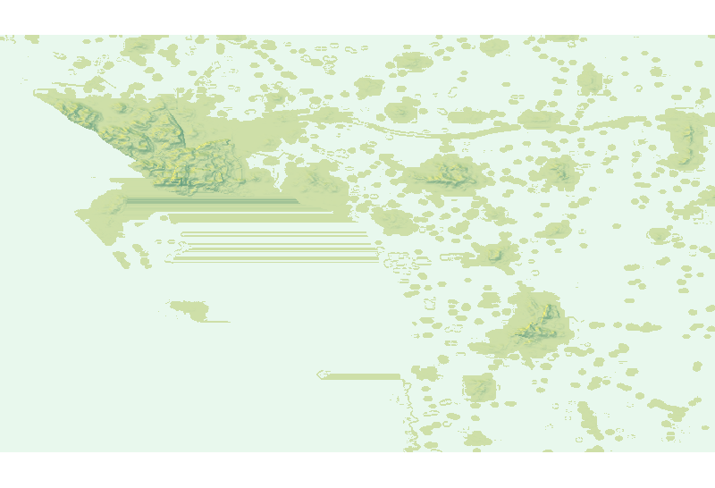
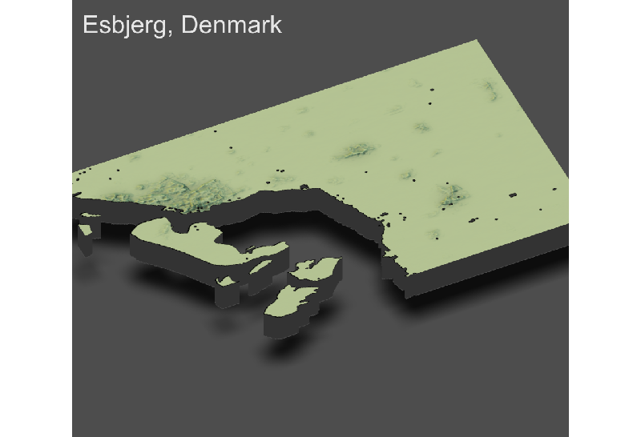
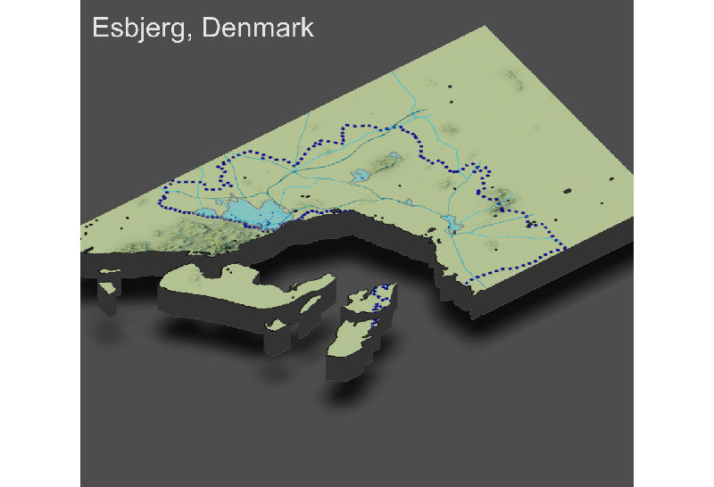

# Final Project
## Accessibility 1
### Deliverable

## Accessibility 2
### Deliverable

The municipality of Esbjerg has a population of 116,705 people and seven distinct urban areas. The city for which the municipality is named is the largest most densely populated  area at 1635/km^2 in the top left corner. The other major urban centers include Bramming, Ribe, Grestedbro, and the neighboring areas of the city Esbjerg in order from highest to lowest density. The shapefile I used categorizes roads by OpenStreetMap classifications of roads linked [here](https://wiki.openstreetmap.org/wiki/Key:highway). I mapped roads down to the secondary level, including linking roads such as ramps and sliproads. The most significant roads branch out from the city of Esbjerg as expected, and connect to Bramming and Grestedbro, but not strangely down to Ribe. A singular motorway or trunk leads out of Esbjerg, but several other primary roads lead out of the region. The only hospital and clinics are in the city of Esbjerg, but pharmacies are more spread out. At first glance one would expect there to be another hospital in the region, but the furthest corner approximately 30 miles from the hospital and Esbjerg and another hospital in a different region may be closer. A single clinic lies outside of the Esbjerg municipality border by how the shapefiles are cut, and some are present on the eastern coast. The ones off the eastern coast are on an island nearby but not considered a part of the municipality. The two islands to the left do not have any significant roads or health centers; one is Mandø, a small island, and the other is a sandbank a part of Nationalpark Vadehavet.

## Accessibility 3
### Deliverable

Plotting issues: In creating this plot, I removed the add_water commmand. The combined_matrix for Esbjerg was very smeared and detected a significant amount of water where there should be land. I had attempted to modify the water levels manually, but decided that removing the add_water command altogether would not make a difference since when looking at satellite view on Google Maps, there aren't significant water features in the region. Because the combined_matrix was smeared, it also didn't line up with the overlays. Since the R build on the ISC computers is only 3.6.1, I wasn't able to plot the final label of the primary urban area, but it is the city of Esbjerg. I think it could be a problem with the tif file—this region of Denmark doesn't vary much in elevation.

Urban areas definitely centralized around areas of higher elevation, but it is of note that the total elevation change is not very high. Since the country itself is very flat almost everywhere but where city developments, it seems like urban developments were moreso a contributing factor than topography on transportation and health care facility development. Because of this, this map provides mostly similar insights as the prior 2D maps. *Note: the blue in the third plot is not water, they represent urban areas.
