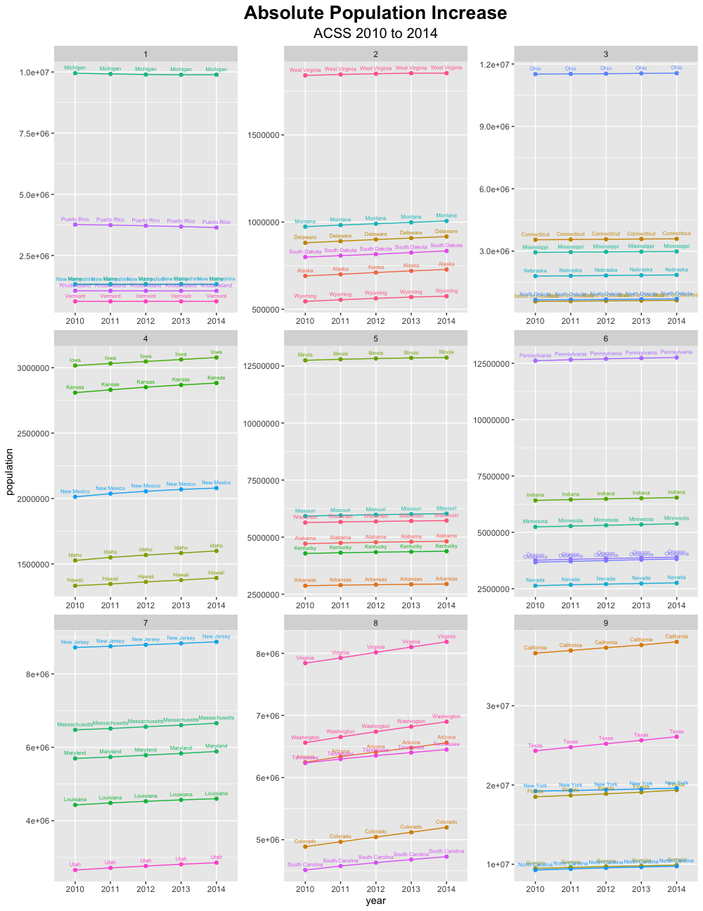
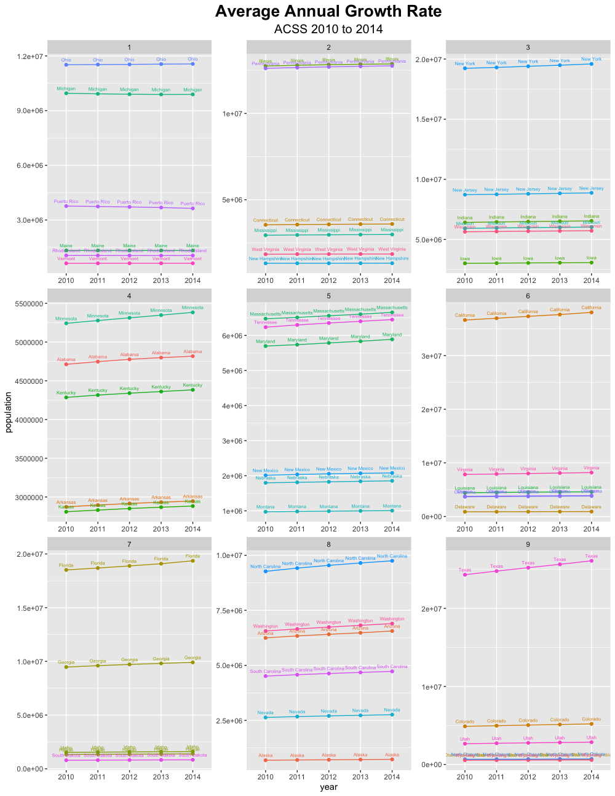
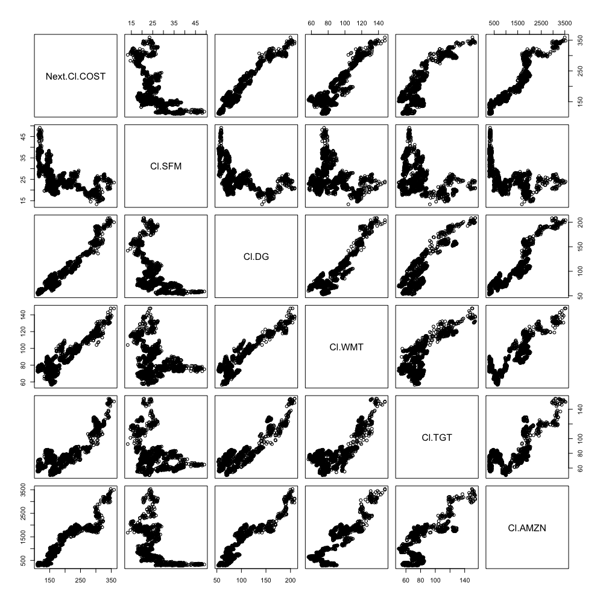
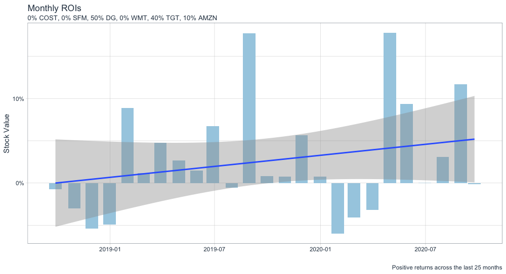
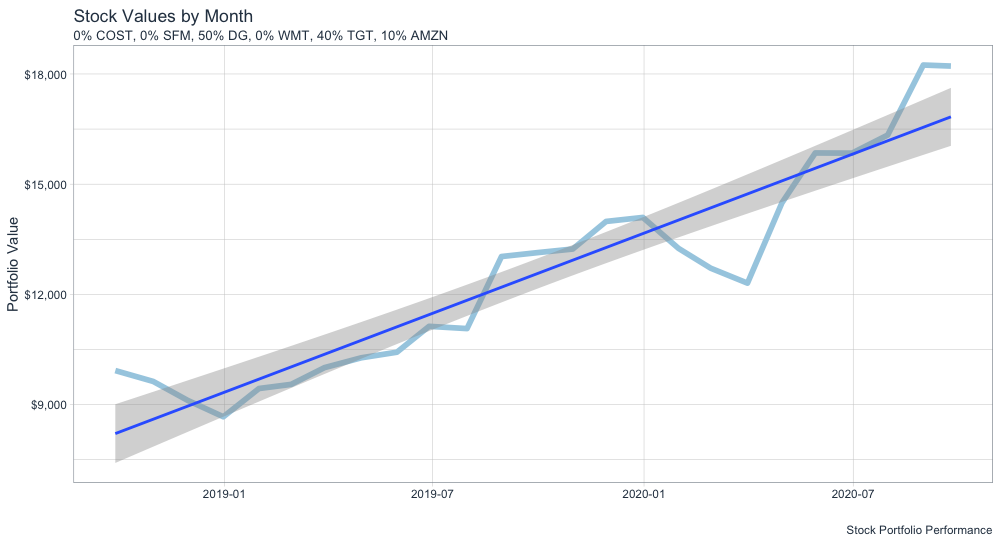

# October 2: Project 2
## Part 1
### Deliverable

## Part 2
### Deliverable

    Model Specified: 
          Next(Cl(COST)) ~ Cl(SFM) 

    Model Target:  Next.Cl.COST 		 Product:  COST 
    Model Inputs:  Cl.SFM 

    Fitted Model: 
      Modelling procedure:  lm 
      Training window:  61  observations from  2020-07-01 to 2020-09-25

    Model Specified: 
          Next(Cl(COST)) ~ Cl(DG) 

    Model Target:  Next.Cl.COST 		 Product:  COST 
    Model Inputs:  Cl.DG 

    Fitted Model: 
      Modelling procedure:  lm 
      Training window:  61  observations from  2020-07-01 to 2020-09-25

    Model Specified: 
         Next(Cl(COST)) ~ Cl(WMT) 

    Model Target:  Next.Cl.COST 		 Product:  COST 
    Model Inputs:  Cl.WMT 

    Fitted Model: 
      Modelling procedure:  lm 
      Training window:  61  observations from  2020-07-01 to 2020-09-25

    Model Specified: 
         Next(Cl(COST)) ~ Cl(TGT) 

    Model Target:  Next.Cl.COST 		 Product:  COST 
    Model Inputs:  Cl.TGT 

    Fitted Model: 
      Modelling procedure:  lm 
      Training window:  61  observations from  2020-07-01 to 2020-09-25

    Model Specified: 
         Next(Cl(COST)) ~ Cl(AMZN) 

    Model Target:  Next.Cl.COST 		 Product:  COST 
    Model Inputs:  Cl.AMZN 

    Fitted Model: 
      Modelling procedure:  lm 
      Training window:  61  observations from  2020-07-01 to 2020-09-25

    rValue
          SFM        DG       WMT       TGT      AMZN 
    0.3537012 0.5895301 0.5674464 0.7393199 0.4445997 
    
    pVolume
          SFM       DG      WMT      TGT     AMZN 
    1949381  2871972 11564206  6693780  5626587 
## Part 3
### Deliverable

