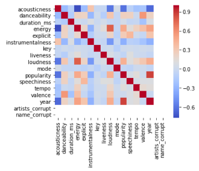

# Data Reflection 3: Spotify Playlist Creation

Spotify is widely recognized as one of the top music streaming companies because of its ability to curate playlists tailored to your taste. Apple Music and Youtube Music have similar systems, but the combination of Spotify’s algorithms, wealth of songs to choose from, and friendly and recognizable user interface make it the most popular streaming service today. Spotify is able to create these playlists and suggest songs based not only on standard measures such as tempo and volume range, but also criteria it judges and ranks on its own. This reflection details one person’s exploration of the dataset and attempt to recreate a version of Spotify’s many algorithms. Spotify’s algorithms and method are likely proprietary, so individuals experimenting with their own data is likely the closest approximation to the real systems that the general public will see.
The Kaggle dataset consists of almost 170,000 songs from 1921 to 2020 and is given a value the following factors as defined by Spotify:
*	Acousticness (how “soft” a song may be—think hard rock vs. soft guitar strumming)
* Danceablity (how easily one can groove to a song based on beat strength, tempo, bass, etc. This is especially prevalent in repetitive pop songs)
* Energy (this factor takes in tempo and dynamics, but also more ambiguously, intensity)
* Instrumentalness (relatively basic: the presence of words or not)
* Liveliness (the likeliness that the song was recorded during a performance before a live audience)
* Loudness (how loud a track is)
* Speeciness (how similar the song is to the spoken word. Rap would score higher while classical would score very low)
* Valence (how happy or sad/angry a song might feel)
* Tempo (the speed in bpm)
The writer first cleaned the data and noted that the data for names that had special characters (e.g. Frédéric Chopin) had to be corrected and unintelligible data was thrown out. He then filtered out “songs” that had a speechiness over .66, which effectively filters out speeches, podcasts, and a very small number of songs. The author recognized that this might happen, but was willing to accept the amount of error (songs accidentally filtered out) for the increased data quality.

He then produced this graph, where red represents a positive relationship (often associated with each other) and blue is a negative relationship. A few conclusions are obvious—more recent songs are more popular due to a myriad of factors involving target audience and publicization, loudness is strongly correlated with energy and slightly less so intensity. He found that acoustic songs had decreased in number over time and tended to be less popular and inferred that it may demonstrate a shift in pop music away from the singer and guitar strumming a love ballad and towards the more synthesized sounds found in EDM. 
To make playlists, he chose factors he wanted to focus on and used OPTICS clustering to find similar songs. OPTICS clustering differs from other cluster based algorithms like DBSCAN because it retains a sense of order or priority in its clusters—useful when you’re looking for a cluster of songs like Taylor Swift, but not a potentially tighter cluster of songs like AJR. The variables were standardized to 0-1 then run through the model.
The author ultimately found it useful for crafting playlists, but also noted the numerous songs that didn’t show up in a cluster. The data inherently are not clustered, so approaching playlist creation through clusters is flawed.

### Sources:
  1. Udell, A. (2020, September 17). Creating Spotify Playlists with Unsupervised Learning. Medium. https://towardsdatascience.com/creating-spotify-playlists-with-unsupervised-learning-9391835fbc7f
