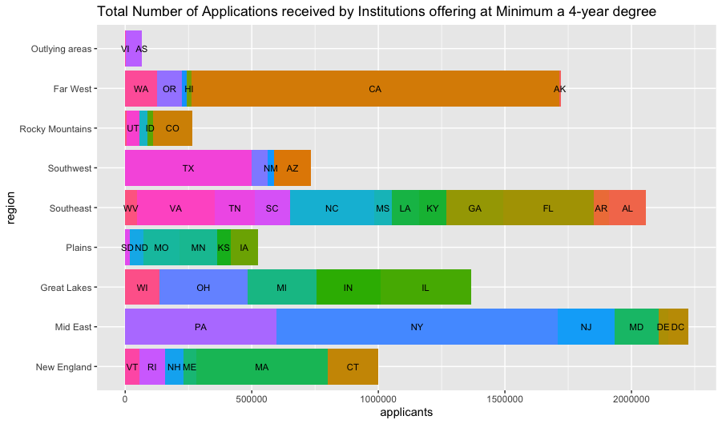
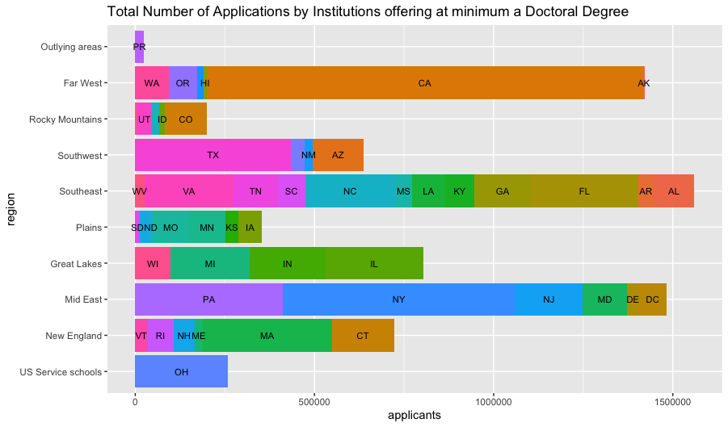
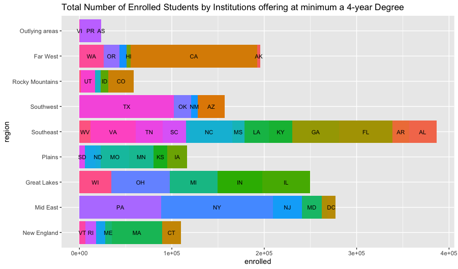
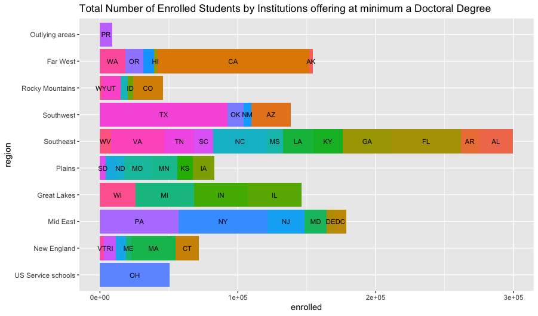

# September 11: Project 1
## Part 1
### Deliverable

___
### Stretch Goal 1

___
### Stretch Goal 2
A quick explanation—the formula used to calculate the selectivity was such:
>`0.90*org_data$admin_rate + 0.1*(1-org_data$enroll_rate)`

A low admission rates and high enrollment rates are more selective. I arbitrarily set a selective number as closer to 0, so I had to invert the enrollement rate through `1-org_data$enroll_rate`. The constants 0.9 and 0.1 were chosen arbitrarily according to what I thought might factor more into selectivity.

[top50selective.csv](top50selective.csv)
___
## Part 2
